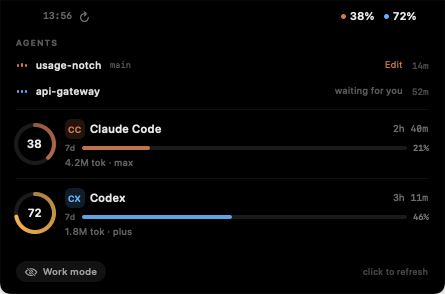
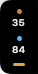

# Usage Notch

An LLM usage meter and live agent monitor that clips onto the edge of your Mac's
screen — or wraps around the notch itself, Dynamic Island style. It shows how much of
your Claude Code and Codex rate-limit windows you have burned, what your open agent
sessions are doing right now, expands into a full panel on hover, and shrinks to a
sliver ("work mode") when you want it gone.




| state | top edge | side edge |
| --- | --- | --- |
| resting |  |  |
| work mode |  |  |

Hovering any of them opens the same panel: your live agent sessions, then a 5-hour
ring, weekly meter, tokens, estimated spend and reset countdown per provider.

## Live agent sessions

Both CLIs write a transcript while they work, and the last record in it says what the
agent is doing right now. Usage Notch tails those files every couple of seconds and
turns them into a Live Activity: which project, which branch, whether it is thinking,
running a tool (the tool's name), responding, or waiting on you — plus how long the
session has been open.

- Claude Code: the newest `assistant` record's `tool_use` block names the running
  tool; a trailing `tool_result` means it is thinking again. `stop_reason` is what
  actually decides whether the turn is over — `end_turn` means done, not "still
  responding".
- Codex: `agent_reasoning`, `exec_command_begin` and `patch_apply_begin` map the same
  way, and `task_complete` marks the end of a turn.

Those end-of-turn markers matter more than they sound. Without them a finished
session keeps reading as busy off its last message, and every session you ran today
piles up in the panel claiming to be alive.

A finished session shows as "done" for five minutes and then drops off; one that goes
quiet mid-turn is marked "stalled" and retired just as quickly. Resumed sessions write
a fresh transcript under the same project, so rows are de-duplicated per agent and
project, keeping the busy one. The list is capped at four. Turn the whole thing off in
*Sources ▸ Live agent sessions*.

## Where it sits

Everything below is in the menu-bar gauge icon, or in the right-click menu on the
pill itself.

- **Display** — automatic (prefers the notched built-in screen), or any connected
  display by name. Pick your external monitor here.
- **Attach to** — *Dynamic island*, *Top*, *Left edge* or *Right edge*.
  - **Dynamic island** wraps the hardware notch: the shape is flush with the top of
    the screen and wide enough that the cutout disappears inside it, with the agent
    readout on one wing and usage on the other. Opened, the notch band becomes the
    panel's header. On a screen without a notch it renders as a floating island of
    the same proportions.
  - **Side** turns the pill into a slim vertical bar hugging the screen edge, with
    the panel opening inward.
- **Position** — only meaningful on the top edge: right of the notch (default), left
  of the notch, or centred under it. On a display without a notch these read
  "right/left of center" and hang below the middle of the menu bar.
- **Drag it.** Press and drag the pill to slide it along its edge; drag it into
  another edge's band (within 90pt) and it re-attaches there, landing under the
  cursor. *Position ▸ Reset to default spot* undoes any nudging.

The pill floats above the menu bar, but only over the pixels it actually draws: the
window is deliberately larger than the pill (so the panel can animate without the
window ever resizing) and stays mouse-transparent, opening up only while the cursor
is over the pill itself. A window swallows every click inside its frame no matter
what its views' hit tests return, so this is `ignoresMouseEvents` toggled from an
event monitor — nothing else can hand a click to another application.

## Where the numbers come from

Everything is read from files the two CLIs already write on this Mac. No API keys,
no network calls, nothing leaves the machine (unless you opt into the Anthropic
account check below).

**Codex — reported, not guessed.** Every `token_count` event in
`~/.codex/sessions/**/rollout-*.jsonl` carries the server's own answer:

```
payload.rate_limits.primary    used_percent, window_minutes 300    -> 5-hour ring
payload.rate_limits.secondary  used_percent, window_minutes 10080  -> weekly meter
```

The newest rollouts are tailed and the most recent event wins, so the ring matches
what Codex itself would tell you *as of your last Codex turn*. Nothing writes to
those files when you use the ChatGPT app, Codex on another machine, or the web, so
the reading can trail your real usage until Codex next makes a request. Once a
reading is more than five minutes old the panel says so ("as of 14:32 · 20m old"),
and opening the panel forces a re-read.

**Claude Code — estimated.** `~/.claude/projects/**/*.jsonl` records per-message
`usage` (input, output, cache creation, cache read) but no plan utilisation. The
provider replays those records, de-duplicates by message + request id, and buckets
them into rolling 5-hour blocks anchored to the top of the hour — the same shape as
Anthropic's session window. The ring compares the live block against a ceiling:

- **auto** (default): your busiest 5-hour block on record
- **fixed**: a number you set, in dollars or tokens

Rows measured this way carry an `est` badge. Spend is priced from the published
per-model list prices in `Pricing.swift`; treat it as an estimate, not a bill.

**Optional: real Claude limits.** *Sources ▸ Use Claude account limits* reads the
Claude Code OAuth token from your login keychain and asks Anthropic for actual
5-hour and weekly utilisation. It is off by default. Enabling it explains itself
first, then does one foreground read so the keychain prompt is visible; if access is
denied it switches itself back off. After that the check runs on its own queue and
never blocks the pill — the local estimate stays on screen if it fails.

### Speed

The transcript folder can run to hundreds of megabytes. Lines are filtered on raw
bytes before any JSON is decoded, and the extracted usage plus per-file read offsets
are cached in `~/Library/Application Support/UsageNotch/claude-cache.json`. First run
after install parses everything (~1s per 200MB); later launches restore from the
cache and refresh in single-digit milliseconds. Providers publish independently, so
a slow one never holds up the others, and one that stops answering is parked rather
than freezing the panel.

## Build and run

Xcode is not required — SwiftPM plus a hand-assembled bundle is enough.

```bash
./run.sh
```

That builds `build/UsageNotch.app`, replaces any running copy, and launches it.
`./build.sh` builds without launching. The app is an accessory (`LSUIElement`), so it
has no Dock icon; the menu-bar gauge icon carries the menu.

Requires macOS 14+ and a Swift 5.9+ toolchain (Command Line Tools are fine).

### Diagnostics

```bash
./build/UsageNotch.app/Contents/MacOS/UsageNotch --dump       # usage + live sessions
./build/UsageNotch.app/Contents/MacOS/UsageNotch --placement  # where the pill would land, per display
./build/UsageNotch.app/Contents/MacOS/UsageNotch --render ./docs  # re-render the screenshots
USAGENOTCH_DEBUG=1 ./build/UsageNotch.app/Contents/MacOS/UsageNotch
```

`--render` snapshots the SwiftUI tree offscreen, which is also how the UI gets
checked when Screen Recording permission is unavailable. `USAGENOTCH_DEBUG=1` traces
placement, hit regions, mode changes and provider timings on stderr.

## Interaction

- **hover** — opens the panel and re-reads the sources; leaving collapses it after a
  short grace period
- **click** — refresh now, with the spin on the refresh glyph
- **drag** — slide the pill along its edge, or throw it at another edge to re-attach
- **work mode** — the chip in the panel (or the menu) collapses the pill to a nub;
  hovering the nub still peeks the full panel
- **right-click** — the full menu, same as the menu-bar icon

## How it fits together

```
main.swift              entry point, --dump / --placement / --render modes
UI/NotchController      panel + status item + refresh loop + menu + click routing
UI/NotchPanel           borderless non-activating panel above the menu bar
UI/NotchGeometry        notch metrics and per-display, per-edge placement
UI/Placement            edge + anchor -> alignment, content rect, corner radii
UI/Layout               every size decision, shared by AppKit hit testing and SwiftUI
UI/ActivityViews        equaliser bars, session chips and rows
UI/NotchState           mini / pill / expanded, hover debounce, motion curves
UI/Interaction          hover tracking and rect reporting for AppKit hit routing
UI/NotchRootView        SwiftUI tree for the three states
Model/UsageStore        provider fan-out, deadlines, published snapshot
Providers/*             Claude Code, Codex, agent activity, account, cache, pricing
```

Two decisions are load-bearing:

- **The window never resizes.** It is sized once for the largest state; the pill
  morphs inside it. Resizing a window per hover is what makes this kind of UI
  stutter.
- **Clicks are routed in AppKit, not SwiftUI.** The panel never becomes key, and
  SwiftUI gesture recognisers do not fire in a non-key panel. The hosting view
  dispatches presses itself: a press that travels more than 4pt is a reposition,
  anything shorter is a click, matched against the rects the controls report.

## Known limits

- Claude percentages are an estimate until you enable the account check.
- Codex numbers are as fresh as your last Codex turn; the panel labels a reading
  older than five minutes. Usage from the ChatGPT app is not visible until Codex
  itself makes another request.
- Only Claude Code and Codex are wired up. Adding a provider means one file
  conforming to `UsageProvider` plus a line in `UsageStore`.
- The app is ad-hoc signed, so "Open at login" may need approval in
  System Settings ▸ General ▸ Login Items.

## License

MIT — see [LICENSE](LICENSE).
